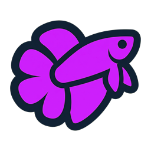
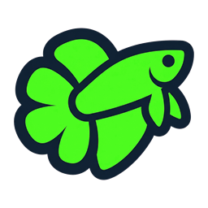
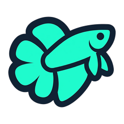
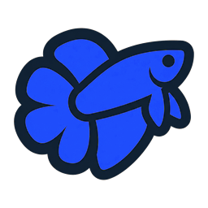

<div align="center">


<h1>Betta</h1>

<b>ZeroTouch for Grasshopper.</b><br/>
<i>Write plain C# functions. Get real Grasshopper components.</i>

<p>
  
  
  
  
</p>

<p>
  
  
  
  
  
  
</p>

</div>

---

Every Grasshopper component is the same process. Subclass `GH_Component`. Hand-register each input and output. Invent a stable GUID. Draw a 24×24 icon. Marshal types in and out of `SolveInstance`. That's forty lines of plumbing before you write the one line you actually came for.

**Write the one line. Betta writes the forty.** Decorate a plain C# method with an attribute — Betta reflects over it at load, builds the ports, assigns a deterministic GUID, picks an icon, and drops a real component on the canvas. It's the idea behind Dynamo's *ZeroTouch*, brought to Grasshopper: **put a DLL in, get nodes out.**

```csharp
[GrasshopperCollection("Strings", "Text")]
public interface IStringCollection : IBettaCollection
{
    [GrasshopperMethod("Upper")]
    string ToUpper([GrasshopperParameter("Text")] string text);

    [GrasshopperMethod("Concat")]
    string Concat(string left, string right, string separator);
}
```

That's a ribbon tab, two components, and all their ports — done. No `GH_Component`, no `RegisterInputParams`, no `SolveInstance`, no GUID to babysit.

<details>
<summary><b>👉 The same <i>single</i> component, hand-written the usual way</b></summary>

```csharp
public class CubeComponent : GH_Component
{
    public CubeComponent() : base("Cube", "Cube", "x³", "Quickstart", "Demo") { }

    protected override void RegisterInputParams(GH_InputParamManager pm)
        => pm.AddNumberParameter("Value", "V", "number to cube", GH_ParamAccess.item, 2.0);

    protected override void RegisterOutputParams(GH_OutputParamManager pm)
        => pm.AddNumberParameter("Result", "R", "x³", GH_ParamAccess.item);

    protected override void SolveInstance(IGH_DataAccess DA)
    {
        double x = 0.0;
        if (!DA.GetData(0, ref x)) return;
        DA.SetData(0, x * x * x);          // ← the only line you meant to write
    }

    public override Guid ComponentGuid => new Guid("d3b07384-…-0001");
    protected override Bitmap Icon => null;
}
```

With Betta, the method body **is** the component. Everything wrapped around it above is what Betta generates for you.
</details>

Your services stay plain and framework-agnostic — no Grasshopper types leak in, so the same code is unit-testable with no Rhino in sight. Betta is just the thin shell that puts it on the canvas.

And every component wears the same betta silhouette, so the family reads as one on the canvas — while each library keeps its own character: its naming, its ports, its geometry. Consistent enough to feel native, distinct enough to feel like itself.

## AI Ready

Betta can be used for AI-assisted authoring — the repo ships a Claude Code skill and a `CLAUDE.md` that hand a coding agent the contract: the attributes, the return-type → output mapping, the deploy path, the GUID-stability gotchas. Drop any agent session into this repo and it knows how to add a component without being told twice.

Sure, an LLM can author a full `GH_Component` from scratch — and it usually does, after a few rounds of fixing the GUID, the param-access modes, and the icon plumbing. With Betta the agent only writes the function body; everything around it is generated deterministically at runtime, so refactors don't re-spend tokens on boilerplate and there's far less hallucinated code in the diff to review.


## Install

> Current release: **0.7.0** — see [CHANGELOG.md](CHANGELOG.md) for what's new.

1. Build `Betta.sln -c Release` (VS 2022 or CLI). The post-build copies `Betta.gha` + deps into `%AppData%\Grasshopper\Libraries\`.
2. Launch Rhino 8 → Grasshopper — the **Betta** and sample **Strings** tabs appear on the ribbon.

Or grab the [latest release](../../releases) (drop-in `.zip` or Rhino Package Manager `.yak`). Components missing? The startup log lists everything published at `%AppData%\Grasshopper\Libraries\Betta.log`.

**Requires** Rhino 8 on Windows. Plugins target `net7.0-windows` (or any TFM that can reference `netstandard2.0`).

## Author a plugin in four steps

1. New class library (`net7.0-windows`).
2. Reference **`Betta.Abstractions`** — the SDK contract, *not* the `.gha` — with `ExcludeAssets="runtime"`.
3. Write a collection (class-direct *or* interface + impl); both opt in by inheriting `IBettaCollection`.
4. Build, drop the DLL into `%AppData%\Grasshopper\Libraries\Betta\`. Betta watches the folder and **hot-adds** it — no restart.

```xml
<PackageReference Include="Betta.Abstractions" Version="0.7.0" ExcludeAssets="runtime" />
```

```csharp
[GrasshopperCollection(Category = "MyPack", SubCategory = "Maths")]
public class MyService : IBettaCollection
{
    [GrasshopperMethod("Cube")]
    public double Cube([GrasshopperParameter("Value")] double x) => x * x * x;
}
```

If a class implements a marked interface, the interface wins (no double registration).

### The whole API is three attributes

| Attribute | Target | Purpose |
|---|---|---|
| `[GrasshopperCollection(category, sub)]` | interface / class | Default Category + SubCategory for the type's methods. |
| `[GrasshopperMethod(name)]` | method | Publishes the method as a component. Also: `NickName`, `Description`, `Category`, `SubCategory`, `IconResource`, `Guid`, `Enabled`. |
| `[GrasshopperParameter(name, …)]` | parameter | Input display name/nickname/description. `List<T>` → list input automatically. `DefaultValue = …` seeds unwired sockets. |

### Outputs are inferred from the return type

| Return type | Outputs |
|---|---|
| primitive / Rhino geometry | one output |
| `List<T>` | one list output |
| `ValueTuple` | one per element (named tuple → named outputs) |
| **plain** custom class | one per public property |
| **opaque** class (`[GrasshopperOpaque]` / `IBettaValue`) | **one typed wire** — Betta auto-generates `Param_BettaGoo<T>` |
| `List<T>` of opaque `T` | one typed list wire |
| `enum` parameter | integer input (wire a slider or panel — names parse too) |
| `Task<T>` / `ValueTask<T>` | async — cached by input hash, re-solves on completion |

Name outputs explicitly with `[return: GrasshopperOutput("Result", "R", "…")]` (repeat with `Index` per tuple element).

### Pass domain objects through pipelines

Mark a domain type opaque to skip return-type explosion and ship the value as a single typed wire:

```csharp
[GrasshopperOpaque]                              // or: class Graph : IBettaValue
public class Graph { /* ... */ }

[GrasshopperMethod("Load")]
Graph Load(string path);

[GrasshopperMethod("Deconstruct")]
(List<Point3d> Nodes, List<Line> Edges) Deconstruct(Graph g);  // ← real pipeline
```

The auto-generated `Param_BettaGoo<T>` carries a deterministic ComponentGuid = `MD5(typeof(T).FullName)`, so saved `.gh` files round-trip across machines and rebuilds.

### Plugin DI hook

Plugins can register their own services for constructor injection:

```csharp
public class MyModule : IBettaModule
{
    public void ConfigureServices(IServiceCollection services) =>
        services.AddSingleton<IGeometryService, GeometryService>();
}
```

Betta discovers every `IBettaModule` in own + loaded plugin assemblies and calls `ConfigureServices` before `BuildServiceProvider`. A faulty module is logged but does not break startup. (Limitation: runtime-dropped plugins — hot-added after Rhino started — do not get a module pass.)

### Viewport preview & bake (`Betta.Preview` package)

Opaque types can opt into Rhino viewport drawing and right-click → bake:

```csharp
using Betta.Preview;
public class Graph : IBettaValue, IBettaPreview, IBettaBakeable {
    public BoundingBox ClippingBox { get; }
    public void DrawWires(IGH_PreviewArgs args)  { /* args.Display.Draw* */ }
    public void DrawMeshes(IGH_PreviewArgs args) { /* args.Display.Draw* */ }
    public void Bake(RhinoDoc doc, ObjectAttributes att, List<Guid> obj_ids) {
        // add Rhino objects to the doc, push their Guids onto obj_ids
    }
}
```

Betta detects the interfaces by name (no hard reference) and the wrapping component forwards Draw / Bake calls via reflection. Only add the `Betta.Preview` package if you want preview or bake — most plugins don't need it.

### Other opt-ins on opaque types

- **`IBettaDefault`** — unwired opaque inputs get a fresh `new T()` instead of `null`.
- **`IBettaSerializable`** — round-trip the opaque value through `.gh` save/reload via `byte[] ToBytes()` / `void LoadFromBytes(byte[])`. Skip if your pipeline always recomputes from inputs.

### Tree inputs and outputs

A method that takes a `GH_Structure<TGoo>` receives the whole tree as one argument; one returning `GH_Structure<TGoo>` emits a tree output. Item/list inputs continue to iterate as before:

```csharp
[GrasshopperMethod("Batch From Tree")]
public List<Graph> BatchFromTree(
    [GrasshopperParameter("Seeds")] GH_Structure<GH_Number> seeds,
    [GrasshopperParameter("Kind")] GraphKind kind);
```

### Param validation

Gate inputs before the method body runs — bad values surface as a runtime Warning and skip the invocation:

```csharp
double Scaled(
    [GrasshopperParameter("Scale"), GrasshopperRange(0.1, 10.0)] double scale,
    [GrasshopperParameter("Label"), GrasshopperNotEmpty] string label);
```

For richer rules implement `IBettaValidator` and attach with `[GrasshopperValidation(typeof(MyValidator))]`.

### Async with cancellation & progress

Methods returning `Task<T>` can take synthetic parameters Betta fills at solve time:

```csharp
[GrasshopperMethod("Slow Sum")]
async Task<double> SumAsync(List<double> xs, CancellationToken ct,
                            IProgress<int> progress);
```

`ct` cancels the moment the component re-solves (so stale work quits). `progress.Report(42)` updates the component's status tag — free progress UI.

### Streaming outputs (`IObservable<T>`)

Return an `IObservable<T>` and the component goes live: Betta subscribes on
first solve (status shows *listening*), and every emission pushes the newest
value through the output — re-solves are coalesced onto the UI thread, so a
chatty source doesn't flood the canvas.

```csharp
[GrasshopperMethod("Sensor Feed")]
IObservable<double> Temperature([GrasshopperParameter("Sensor")] string id);
```

Change a wired input and the old subscription is disposed and a fresh one
opened; delete the component and the subscription is cleaned up with it.

### Per-instance state via menu (no extra wire)

Tag a parameter `[GrasshopperMenuState]` to bind it to a right-click menu pick instead of a wired input. Enum and bool types get a UI editor; other types accept the persisted value:

```csharp
[GrasshopperMethod("Render")]
Bitmap Render([GrasshopperParameter("Quality"), GrasshopperMenuState] Quality q,
              [GrasshopperParameter("Scene")] string scene);
```

### Secrets, triggers, and value-list presets

Three attributes cover the most common cloud-API component ergonomics:

- **`[GrasshopperSecret("openai.api_key")]`** on a `string` parameter — value read from Windows Credential Manager (DPAPI-backed) at solve time. Not wired; users set once via the **Betta → Secrets…** menu.
- **`[GrasshopperTrigger]`** on a `bool` parameter — component adds a **Run** menu item and only fires when clicked. Between clicks the solve exits with `Message = "awaiting run"`, so upstream wire changes never accidentally spend API calls.
- **`[GrasshopperValueList("1:1", "16:9", "4:3")]`** on any input parameter — when the component is placed, Betta auto-drops a wired `GH_ValueList` seeded with those items. Users still get an actual GH dropdown; you don't have to place one manually.

```csharp
[GrasshopperMethod("Generate")]
public async Task<BettaImage> Generate(
    [GrasshopperParameter("Prompt")] string prompt,
    [GrasshopperValueList("1:1", "16:9", "9:16")] string aspect,
    [GrasshopperSecret("openai.api_key")] string apiKey,
    [GrasshopperTrigger] bool run,
    CancellationToken ct) { … }
```

### Trusted publishers (opt-in DLL signing)

Off by default. Enable via **Betta → Trusted publishers…** to pick between `Off` / `WarnOnly` / `Enforce` and import trusted publisher certificates (from a `.cer` file or by pointing at a signed DLL). Enforced in `PluginLoader` before the ALC loads bytes.

### Built-in introspection

- **Betta Inspector** component lists every registered descriptor on solve.
- **`Betta_Status`** Rhino command writes the same to the command line.
- **`betta-docs`** dotnet tool walks loaded plugins and emits markdown documentation per category.

### Async, hot-reload, and the source generator

- **Async** (`Task<T>` / `ValueTask<T>` returns) — non-blocking solve, bounded LRU cache with in-flight dedupe.
- **Hot-reload** — when you drop a replaced DLL into the Betta folder mid-session, Betta now writes a visible warning to the Rhino command line telling you to restart. (True ALC-based unload is roadmap.)
- **`Betta.Generators`** (preview) — Roslyn source generator that emits a manifest of `[GrasshopperMethod]` members. v0.4 is metadata-only; future versions will replace runtime reflection with generated registrations. Opt-in via package reference.

## A fish per component

Each component wears one of six embedded **Mini betta** silhouettes — Amber, Aqua, Cosmic, Forest, Lime, Rose — picked deterministically from its GUID and rendered at 24×24 (content-cropped, aspect-preserving, no recoloring):

```csharp
var idx = descriptor.Guid.ToByteArray()[0] % SessionFish.Count;
```

Same component → same fish, every session and every machine. Prefer your own art? `[GrasshopperMethod("Foo", IconResource = "my_icon.png")]` ships an embedded PNG, rendered verbatim.

## How it works

```
IBettaCollection interface/class          [Betta.Abstractions]
        ↓  reflection at startup
ComponentRegistry → ComponentDescriptor   [Betta.gha]  one per [GrasshopperMethod]
        ↓
BettaComponentProxy (IGH_ObjectProxy)      Instances.ComponentServer.AddProxy
        ↓  on canvas drop
BettaComponent (GH_Component)              generic; all proxies share one CLR type
        ↓  per solve
ParamInjector                              inputs → Method.Invoke(service, args) → outputs
```

Component GUIDs are deterministic — an MD5 of the method signature — so saved `.gh` files survive rebuilds and moving code between machines. Services resolve from a DI container built once in `Startup.PriorityLoad`, with logging injected automatically. Rename the display name freely; rename the *method, type, or a parameter* and the GUID changes (pin `Guid = "…"` to refactor without breaking saved files).

## Layout

```
Betta.Abstractions/   public contract (netstandard2.0, NuGet-ready)
Betta/                runtime plugin (.gha) — Startup, Services, Components, Rendering
Betta.Strings/        sample plugin (project reference)
samples/
  Betta.Quickstart/   minimal sample (NuGet package reference)
  Betta.Tour/         guided tour: Basics → Intermediate → Advanced
TestBetta/            xUnit tests (Rhino.Inside, headless GH)
```

## Build & package

```bash
dotnet build Betta.sln -c Debug                                       # plugin + samples
dotnet test  TestBetta/TestBetta.csproj                               # needs Rhino 8 (Rhino.Inside)
dotnet pack  Betta.Abstractions/Betta.Abstractions.csproj -c Release  # → ./artifacts/*.nupkg
```

`Betta.Abstractions` is the only NuGet-published project (`GeneratePackageOnBuild` is off — pack explicitly). `samples/Betta.Quickstart` restores it from the local `artifacts/` feed to exercise the packaged authoring flow.

## Not yet supported

Tree inputs (`GH_Structure<T>`), hot-reload of *replaced* plugins, a canvas LoadLibrary component, and a real settings panel — see [ROADMAP.md](ROADMAP.md).

## License

[MPL-2.0](LICENSE). **Plugins built on top are unaffected** — the copyleft is *file-level*, attaching only to source files that carry Betta's MPL header (everything in `Betta/` and `Betta.Abstractions/`). A plugin DLL that references `Betta.Abstractions` and runs against `Betta.gha` is its own work in its own files; ship it under any license you want — MIT, proprietary, paid, closed. Referencing, inheriting from, or extending Betta's types does **not** transfer MPL to your code.

The only ask: if you modify a Betta source file and distribute the modified version, you publish those changes back under MPL. Your own files stay yours.
